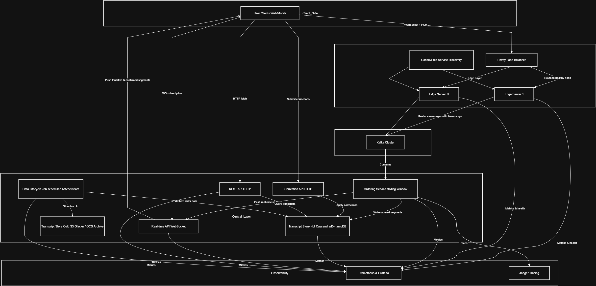

# Assembly AI - Real-time Transcription WebSocket Server

A high-performance Go WebSocket server that provides real-time audio transcription using AssemblyAI's streaming API. This server handles audio streaming from clients and returns live transcription results through WebSocket connections.

## Table of Contents

- [Features](#features)
- [Prerequisites](#prerequisites)
- [Installation](#installation)
- [Configuration](#configuration)
- [Running the Server](#running-the-server)
- [API Documentation](#api-documentation)
- [WebSocket Protocol](#websocket-protocol)
- [Audio Requirements](#audio-requirements)
- [Error Handling](#error-handling)
- [Development](#development)
- [Troubleshooting](#troubleshooting)

## Features

- **Real-time Audio Transcription**: Stream audio data and receive live transcription results
- **WebSocket Communication**: Bidirectional communication for low-latency audio streaming
- **Session Management**: Persistent session storage with transcript history
- **REST API**: RESTful endpoints for retrieving session data and transcripts
- **Concurrent Client Support**: Handle multiple simultaneous transcription sessions
- **Thread-safe Operations**: Safe concurrent access to session data
- **Audio Format Support**: PCM audio format with configurable sample rates

## Prerequisites

- **Go**: Version 1.23.0 or higher
- **AssemblyAI API Key**: Required for transcription services
- **Git**: For cloning the repository

## Installation

1. **Clone the repository**:

   ```bash
   git clone https://github.com/raihanakbr/assemblyai-realtime-transcription.git
   cd assemblyai-realtime-transcription
   ```

2. **Install dependencies**:

   ```bash
   go mod download
   ```

3. **Run the application**:
   ```bash
   go run cmd/server/main.go
   ```

## Configuration

### Environment Variables

Create a `.env` file in the project root or set these environment variables:

| Variable              | Required | Description             | Default |
| --------------------- | -------- | ----------------------- | ------- |
| `ASSEMBLY_AI_API_KEY` | **Yes**  | Your AssemblyAI API key | -       |

### Getting an AssemblyAI API Key

1. Sign up at [AssemblyAI](https://www.assemblyai.com/)
2. Navigate to your dashboard
3. Copy your API key from the account settings
4. Set it as the `ASSEMBLY_AI_API_KEY` environment variable

## Running the Server

### Using the Binary

```bash
# Set your API key
export ASSEMBLY_AI_API_KEY="your_api_key_here"

# Run the server
./bin/server
```

### Using Go Run

```bash
# Set your API key
export ASSEMBLY_AI_API_KEY="your_api_key_here"

# Run directly
go run cmd/server/main.go
```

### Using a .env File

```bash
# Create .env file
echo "ASSEMBLY_AI_API_KEY=your_api_key_here" > .env

# Run the server
go run cmd/server/main.go
```

The server will start on `http://localhost:8080` by default.

## API Documentation

### WebSocket Endpoint

#### Connect to WebSocket

```
ws://localhost:8080/ws?connection_id=<unique_id>
```

**Parameters:**

- `connection_id` (required): Unique identifier for the session

**Example:**

```javascript
const ws = new WebSocket("ws://localhost:8080/ws?connection_id=user123");
```

### REST API Endpoints

#### Get Session Status (Health Check)

```http
GET /api/session?connection_id=<id>
```

**Parameters:**

- `connection_id` (required): Session identifier

**Response:**

```json
{
  "id": "user123",
  "start_time": "2024-01-01T12:00:00Z",
  "end_time": "2024-01-01T12:05:30Z",
  "total_audio_duration": 330.5,
  "status": "active",
  "error_message": "",
  "transcript_count": 5,
  "is_active": true
}
```

#### Get Transcripts

```http
GET /api/transcripts?connection_id=<id>
```

**Parameters:**

- `connection_id` (required): Session identifier

**Response:**

```json
{
  "connection_id": "user123",
  "start_time": "2024-01-01T12:00:00Z",
  "end_time": "2024-01-01T12:05:30Z",
  "total_audio_duration": 330.5,
  "status": "completed",
  "transcripts": [
    {
      "text": "Hello world",
      "start": 0.5,
      "end": 1.2,
      "timestamp": "2024-01-01T12:00:00Z"
    }
  ],
  "count": 1
}
```

### Session Status Values

The `status` field in API responses indicates the current state of the transcription session:

| Status      | Description                                           |
| ----------- | ----------------------------------------------------- |
| `active`    | Session is currently running and accepting audio data |
| `completed` | Session has ended successfully                        |
| `error`     | Session encountered an error and was terminated       |

**Additional Response Fields:**

- `start_time`: When the session was created (ISO 8601 format)
- `end_time`: When the session ended (only present for completed/error sessions)
- `total_audio_duration`: Total duration of processed audio in seconds
- `error_message`: Detailed error information (only present when status is "error")

### HTTP Status Codes

| Code  | Description                                   |
| ----- | --------------------------------------------- |
| `200` | Success                                       |
| `400` | Bad Request - Missing connection_id parameter |
| `404` | Not Found - Session not found                 |
| `405` | Method Not Allowed - Invalid HTTP method      |
| `500` | Internal Server Error                         |

## WebSocket Protocol

### Sending Audio Data

Send binary audio data directly through the WebSocket connection:

```javascript
// Example: Send PCM audio data
const audioData = new Uint8Array(/* your PCM audio data */);
ws.send(audioData);
```

### Receiving Transcription Results

The server sends JSON messages with real-time transcription results:

**Real-time Transcript Response Format:**

```json
{
  "text": "Hello world, this is a test transcription",
  "start": 1.5,
  "end": 3.2
}
```

**Error Response Format:**

```json
{
  "error": true,
  "message": "Transcription error: Invalid audio format"
}
```

**Response Fields:**

- `text` (string): The transcribed text from the audio
- `start` (float): Start time of the transcript segment in seconds
- `end` (float): End time of the transcript segment in seconds
- `error` (boolean): Present and `true` when an error occurs
- `message` (string): Error description when `error` is `true`

## Audio Requirements

### Supported Formats

- **Format**: PCM (Pulse Code Modulation)
- **Sample Rate**: 16,000 Hz (configurable)
- **Channels**: Mono (1 channel)
- **Bit Depth**: 16-bit
- **Byte Order**: Little-endian

### Audio Streaming Guidelines

- Send audio in chunks of 50ms to 1000ms duration
- Optimal chunk size: ~200-500ms for best latency/quality balance
- Maximum chunk size: 32,000 bytes (1 second at 16kHz)
- Minimum chunk size: 1,600 bytes (50ms at 16kHz)

## Error Handling

### WebSocket Errors

- Connection failures are logged and the client connection is closed
- AssemblyAI connection errors result in client disconnection
- Audio processing errors are logged but don't terminate the session

### Common Error Scenarios

1. **Missing API Key**: Server fails to start
2. **Invalid connection_id**: Session not found (404)
3. **Network Issues**: WebSocket connection drops
4. **Audio Format Issues**: AssemblyAI rejects audio data

### Logging

The server provides detailed logging for:

- Client connections and disconnections
- AssemblyAI communication status
- Error conditions and debugging information

## Development

### Project Structure

```
go-websocket-server/
├── cmd/
│   └── server/
│       └── main.go          # Application entry point
├── internal/
│   └── websocket/
│       ├── client.go        # Client connection handling
│       ├── config.go        # Configuration constants
│       ├── handlers.go      # HTTP and WebSocket handlers
│       └── types.go         # Data structures
├── go.mod                   # Go module definition
├── go.sum                   # Dependency checksums
└── README.md               # This file
```

### Dependencies

- `github.com/gorilla/websocket v1.5.3` - WebSocket implementation
- `github.com/joho/godotenv v1.5.1` - Environment variable loading
- `github.com/oklog/ulid/v2 v2.1.1` - Unique ID generation

### Building for Production

```bash
# Build optimized binary
go build -ldflags="-w -s" -o bin/server cmd/server/main.go

# Cross-compile for Linux
GOOS=linux GOARCH=amd64 go build -o bin/server-linux cmd/server/main.go
```

## Troubleshooting

### Common Issues

1. **Server won't start**

   - Verify `ASSEMBLY_AI_API_KEY` is set
   - Check if port 8080 is available
   - Ensure Go version 1.23.0+

2. **No transcription results**

   - Verify audio format (PCM, 16kHz, mono)
   - Check AssemblyAI API key validity
   - Monitor server logs for connection issues

3. **WebSocket connection fails**

   - Check network connectivity
   - Verify WebSocket URL format

4. **High latency**
   - Reduce audio chunk size
   - Check network connection quality
   - Monitor server resource usage

## License

This project is licensed under the MIT License - see the LICENSE file for details.

## Support

For issues and questions:

1. Check the [Troubleshooting](#troubleshooting) section
2. Review server logs for error messages
3. Open an issue on GitHub
4. Contact the AssemblyAI support team for API-related issues

# Part 2 - System Design

## Design Question - Answers

### 1. Message Ordering Approach

To handle out-of-order messages, a centralized ordering mechanism based on precise timestamps and a buffer is proposed.

**Data Structures and Algorithms:**

- **Timestamping:** Every transcript segment generated by an edge server will be tagged with a precise UTC timestamp marking the moment the audio was spoken.
- **Priority Queue (Min-Heap):** At the central service, all incoming segments for a specific meeting are placed into a Priority Queue, which automatically sorts them based on their timestamp. The segment with the earliest timestamp is always at the front.
- **Watermarking and Buffering:** The system will only process segments from the queue once it's "safe" to do so. It establishes a "watermark" based on the lowest timestamp received across all active streams. This creates a buffer period (e.g., 500 ms – 1 s), allowing late segments to arrive and be placed in their correct sequence before the transcript is finalized. This approach adheres to the maximum 2-second delay requirement.

```
Buffer Period = Max Total Delay - Network Latency - Other Processing & Hops

Buffer Period = 2000ms - 500ms - (700ms ~ 1000ms) (estimated) = (500ms ~ 800ms)
```

And based on industry best practice, we should do (100ms ~ 250ms) interval watermark to ensure the final transcript appears smooth and responsive to the user, while also preventing excessive computational load on the server.

**Considered & Dismissed Approaches:**

- **FIFO:** Fails to solve the core ordering problem.
- **Client-side Ordering:** Leads to inconsistent transcript views and no single source of truth.
- **Global Sequencer Service:** A dedicated sequencer could assign a total order, but it becomes a single point of failure and performance bottleneck, adding extra round-trips.
- **NTP-Synchronized Timestamps Only:** Relying on perfectly synced clocks and timestamps is appealing in theory but fails in practice due to network jitter, drift, and edge-server clock skew.

### 2. Fault Tolerance

**How would you handle missing segments or late arrivals?**  
 If a segment hasn’t arrived by the watermark’s tolerance threshold (e.g., 2 s), the system marks it as missing and inserts a “[audio drop]” placeholder; any segments that arrive too late can either be submitted as corrections via a separate API or discarded if they exceed an additional lateness limit.

**What happens if an edge server goes down?**  
 To handle edge server failures, each server runs health checks through Consul or Etcd, an Envoy load balancer automatically redirects traffic to the nearest healthy node, and edge servers keep a local buffer of recent segments (e.g., several minutes) so they can seamlessly resume streaming after a restart without losing context.

### 3. Trade-offs

**What trade-offs would you consider between latency and accuracy?**  
The proposed buffering mechanism intentionally introduces a small, controlled delay to achieve high-quality, readable transcripts, which is often a better user experience than receiving a nonsensical transcript instantly. This aligns with the requirement for readable and accurate transcripts for compliance purposes.

For example, if it is an important meeting then maybe we can tolerate the delay because accuracy is more important.

**How would you balance real-time requirements with ordering guarantees?**  
You can shrink or grow your reordering buffer on the fly, use a small allowed-lateness when traffic is light and increase it under heavy overlap, and pair that with optimistic delivery, where you push each segment downstream immediately (marked “tentative”) and then issue corrections only if out-of-order segments arrive later.

## Architecture Diagram



### Summary

- **Audio Ingestion**
  Clients (web/mobile) stream PCM over WebSocket to an Envoy load balancer, which routes to a healthy Edge Server (registered via Consul/Etcd).

- **Decoupling & Durability (Kafka Cluster)**
  Edge servers timestamp and sequence each transcript segment, then produce them to Kafka which is a durable, partitioned broker that buffers, guarantees per-meeting ordering, supports replay for recovery, and handles backpressure.

- **Reordering & Real-time Delivery (Ordering Service)**
  The Ordering Service consumes from Kafka, applies an event-time sliding-window (watermark) to reorder late segments within a bounded delay, then:

  - **Writes ordered segments** into the **hot store** (Cassandra/DynamoDB).

    > **Why Cassandra/DynamoDB?** They offer horizontal write scalability for high-throughput, low-latency reads/writes, automatic partitioning and multi-region replication for high availability, flexible schema with TTL support for automatic data expiry, and built-in durability which is perfect for real-time transcript workloads.

  - **Pushes live updates** to clients via a dedicated WebSocket API.

- **Historical Access & Corrections**
  A REST API serves archived transcripts from the hot store and exposes a Correction API for user-submitted edits. If data isn’t found in hot storage, a Cold Retrieval path fetches it from long-term archive (e.g. S3 Glacier) and optionally backfills the hot store.

- **Cost Control (Data Lifecycle Job)**
  A scheduled job migrates transcripts older than a configurable threshold (e.g. 90 days) from hot storage to cold storage, optimizing long-term costs.

- **Observability**
  All components emit metrics (Prometheus/Grafana) and traces (Jaeger), ensuring visibility into performance, health, and bottlenecks.

## Implementation Consideration

### Key Technologies and Frameworks

- **Backend Services (Edge & Central)**: Go or Rust would be ideal choices due to their high performance, excellent concurrency support, and low memory footprint, which are perfect for handling many simultaneous network connections.

- **Messaging Layer**: Apache Kafka is the best fit for acting as the central message bus. Its ability to handle high-throughput data streams, provide fault tolerance, and persist messages makes it perfect for queuing transcript segments.

- **Database**: A wide-column NoSQL database like Apache Cassandra or a managed service like Amazon DynamoDB would be used for the transcript store. These databases are designed for high-write throughput and horizontal scalability.

- **Communication**: WebSockets would be used for the real-time, bidirectional communication between the client and the edge servers. For internal communication between microservices, gRPC would be used for its high performance and efficiency.

- **Service Mesh & Discovery**: Envoy would serve as the edge proxy/load balancer, with Consul or Etcd providing service discovery to dynamically manage the fleet of healthy edge servers.

### Scalability Considerations

- **Horizontal Scaling**: The entire architecture is designed around horizontal scalability. The edge servers and the central ordering service would be built as stateless applications. This means we can easily increase capacity by simply adding more server instances behind the load balancer as user load grows.

- **Database and Messaging Scalability**: Both Kafka and Cassandra/DynamoDB are inherently distributed systems. They can be scaled out by adding more nodes to their respective clusters to handle increased data volume and traffic.

- **Geographic Distribution**: The core design of using edge servers is a key scalability and performance strategy. By processing audio near the user, we minimize network latency and distribute the processing load globally rather than concentrating it in a single data center.

### Monitoring and Debugging Strategies

- **Metrics**: A monitoring solution using Prometheus for data collection and Grafana for visualization would be implemented. We would track key metrics such as API request latency, error rates, Kafka consumer lag, and system resource usage (CPU/Memory) for all services.

- **Logging**: A centralized logging system like the ELK Stack (Elasticsearch, Logstash, Kibana) or Loki would be used. All services would emit structured logs (e.g., JSON), allowing engineers to search and analyze logs from across the entire distributed system in one place.

- **Tracing**: To debug performance issues and understand request flows, distributed tracing with a tool like Jaeger or OpenTelemetry is essential. This would allow us to trace a single user's request as it travels from the client through the edge server, Kafka, and various central services, making it easy to pinpoint bottlenecks.
